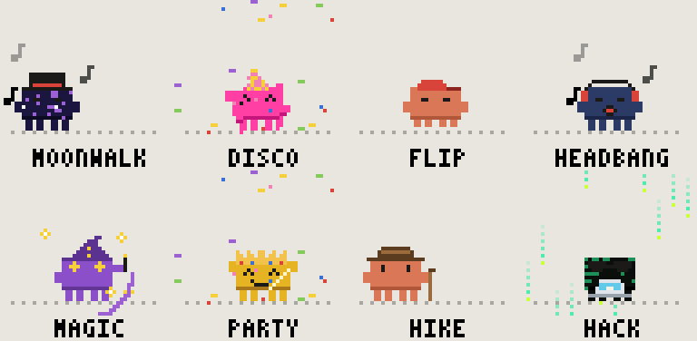
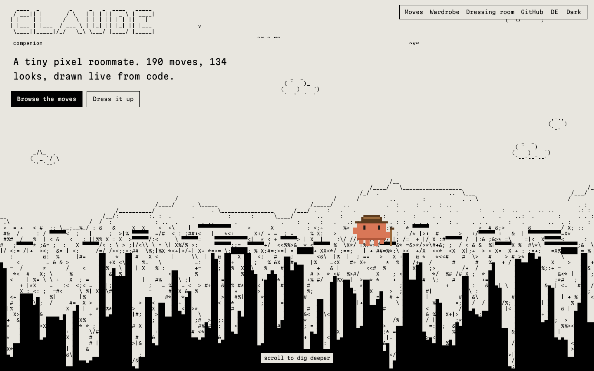
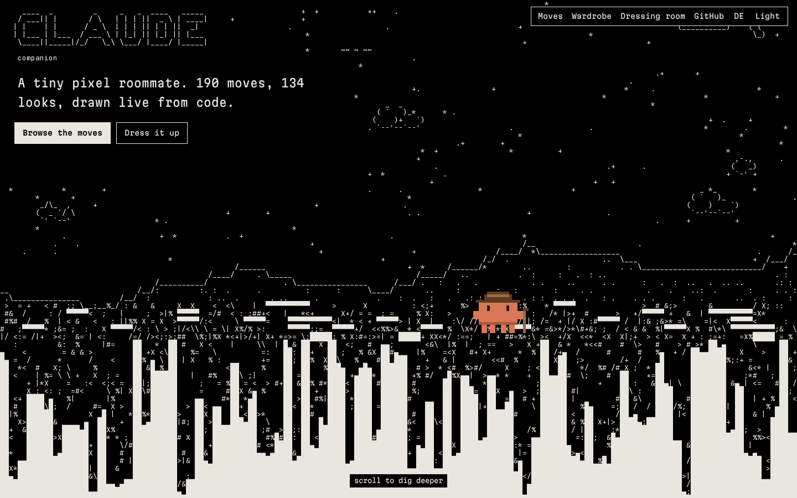
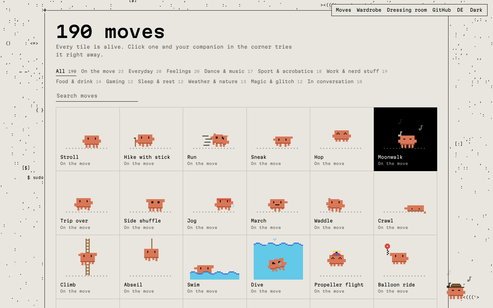
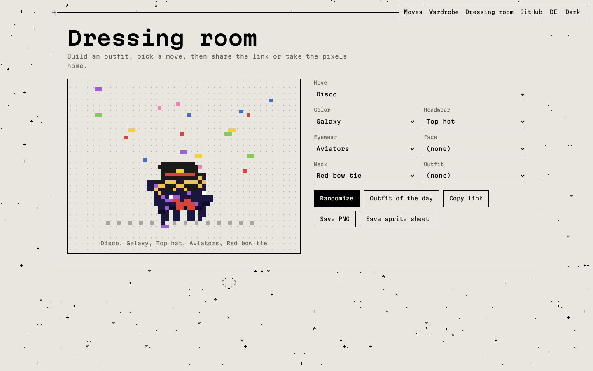
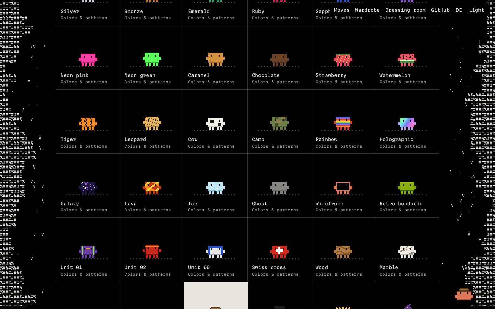
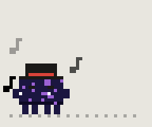
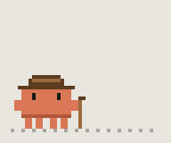
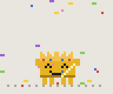

<div align="center">



# Claude Companion

**A tiny pixel roommate, drawn live from code.**
190 moves, 134 looks, zero image files.

[](https://silvertree2010.github.io/claude-companion/)
[](#moves)
[](#looks)
[](#how-it-works)
[](#how-it-works)
[](LICENSE)

[**Open the site**](https://silvertree2010.github.io/claude-companion/) &nbsp;·&nbsp; [Dressing room](https://silvertree2010.github.io/claude-companion/#dressing-room) &nbsp;·&nbsp; [Render a GIF](#render-from-the-command-line)

</div>

---

## What this is

A little orange creature with four legs and too many hobbies. It walks through an ASCII landscape, dances, naps, hacks, eats noodles and occasionally glitches out of existence.

There are no sprite sheets anywhere in this repo. The companion is a rig of rectangles, and every one of its 190 moves is a small function that bends that rig over time. The ASCII world behind the site is generated too: sky, meadow, soil full of buried junk, a cave, and deep space at the very bottom.

The moves and looks here are the hand-picked favourites out of a bigger set of 200 moves and 229 looks.

## Screenshots

| | |
|:--:|:--:|
|  |  |
| The hero, by day | …and by night |
|  |  |
| 190 moves, all alive | The dressing room |

<p align="center"></p>

## Try it

**Online:** [silvertree2010.github.io/claude-companion](https://silvertree2010.github.io/claude-companion/)

**Locally:** it's plain HTML, CSS and JavaScript, so any static server works.

```sh
git clone https://github.com/Silvertree2010/claude-companion.git
cd claude-companion
python3 -m http.server 8000
# open http://localhost:8000
```

What you can do there:

- **Browse** all moves and looks, filtered by group or searched by name. Every tile animates.
- **Dress it up.** Click a look to put it on, click again to take it off. Your companion in the corner wears it right away.
- **Share an outfit.** The dressing room writes the whole look into the link, like `#look=m:b-disco;skin:a-galaxie;kopf:a-zylinder`.
- **Take the pixels home** as a PNG or a 24-frame sprite sheet.
- **Switch** between English and German, light and dark.

## Render from the command line

No browser needed. The renderer runs the same engine in Node and writes PNG frames plus a sprite sheet, without any packages.

```sh
node tools/render.mjs "Moonwalk" --wear "Top hat,Galaxy" --scale 8 --frames 24
node tools/render.mjs            # lists every move
```

<p align="center">
  
  
  
</p>

Options: `--wear` takes any look names, comma separated. `--scale` sets the pixel size, `--frames` and `--fps` set the length, `--out` the folder.

## Moves

| Group | Count | A few favourites |
|---|--:|---|
| On the move | 23 | Moonwalk, Propeller flight, Umbrella glide, Teleport |
| Everyday | 20 | Doomscroll, Selfie, Sneeze, Water the plants |
| Feelings | 20 | Meltdown, In love, Sulk, Idea |
| Dance & music | 17 | Floss, Robot dance, DJ set, Line dance |
| Sport & acrobatics | 18 | Backflip, Cartwheel, Jump rope, Tree pose |
| Work & nerd stuff | 19 | Waiting for the build, This is fine, Pet the server |
| Food & drink | 14 | Slurp noodles, Food coma, Blow out candles |
| Gaming | 12 | Rage quit, Loot!, Respawn, Speedrun |
| Sleep & rest | 12 | Dream, Hammock, Stargazing, Sleepwalk |
| Weather & nature | 13 | Thunderstorm, Snowball fight, Pet the cat |
| Magic & glitch | 12 | Disintegrate, Through the portal, Clone |
| In conversation | 10 | Listening, Thinking, Talking, Error 404 |

## Looks

| Slot | Count | Some of them |
|---|--:|---|
| Colors & patterns | 44 | Galaxy, Lava, Holographic, Cow, Wireframe, Unit 01 |
| Headwear | 55 | Top hat, Propeller cap, Viking helmet, William Tell's apple |
| Eyewear | 16 | Aviators, 3D glasses, Cyber visor, Monocle |
| Face | 5 | Clown nose, Vampire fangs |
| Neck | 11 | Polka-dot bow tie, Gold chain, Medal |
| Outfits | 3 | Suit, Tuxedo, Jersey No. 10 |

## How it works

```
       .------------.
  [==] |  ▌      ▌  | [==]   arms
       |   eyes     |
       |            |
       '------------'
         ▌▌ ▌▌  ▌▌ ▌▌        legs
```

- **The rig.** A 48 × 40 pixel canvas holds a body, two arms, four legs and two eyes. A pose is just a handful of numbers: offsets, which legs are lifted, the eye shape, arm positions, a rotation.
- **Moves are functions.** Each one takes the pose and the time and nudges it. That's the whole moonwalk:

  ```js
  neu("Moonwalk", "Unterwegs", (p, t) => {
    gehen(p, t, 1.5);
    p.augen = "zu";
    p.fx.push(fx("noten"));
  }, { laeuft: -6 });
  ```

  (The source speaks German. `gehen` is walk, `augen` are the eyes, `noten` are music notes. The site speaks both languages.)
- **Looks are tiny pixel maps** pinned to anchor points like the top of the head or the eye line, so a hat still sits right when the body squashes mid-jump.
- **Rotation without blur.** The figure is rasterised into a small buffer first and then sampled back with nearest-neighbour, so a backflip stays chunky instead of smeared.
- **The world** is a deterministic noise function over rows and columns. Scrolling just moves the window through it, and only the clouds, worms, drips, stars and the comet move on their own.

## Easter eggs

- Click the companion in the corner. It has opinions.
- Type `claude` anywhere on the page.
- You probably know the one with the arrow keys.

## Project layout

```
index.html          the site
style.css
site.js             galleries, dressing room, companion, world scrolling
engine/
  pixel.js          rig, drawing, effects, pixel font
  props.js          everything the companion can hold
  zubehoer.js       looks (colors, hats, glasses, …)
  animationen.js    the 190 moves
  namen.js          English names
  landschaft.js     the hero landscape
  welt.js           the endless world below it
tools/render.mjs    command-line renderer
assets/             screenshots, GIFs, the ASCII font subset
```

## Credits

- The look is inspired by **Claude FM**, the lo-fi stream you get with `/radio` in Claude Code.
- UI type is [Martian Mono](https://github.com/evilmartians/mono). The ASCII art uses a subset of [JetBrains Mono](https://github.com/JetBrains/JetBrainsMono) (SIL Open Font License, see `assets/fonts/OFL.txt`).

**Unofficial fan project.** Not affiliated with or endorsed by Anthropic. Claude is a trademark of Anthropic.

## License

Code under the [MIT License](LICENSE).
